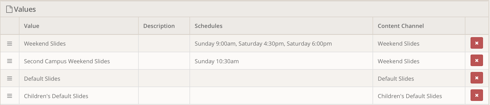
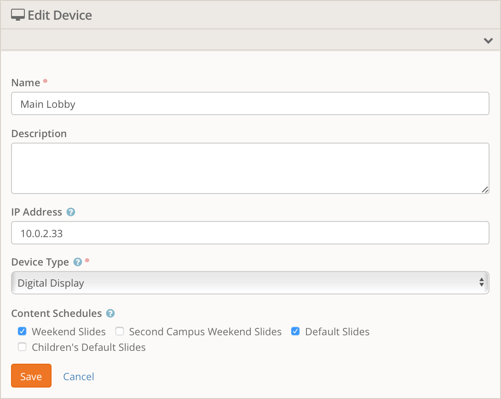
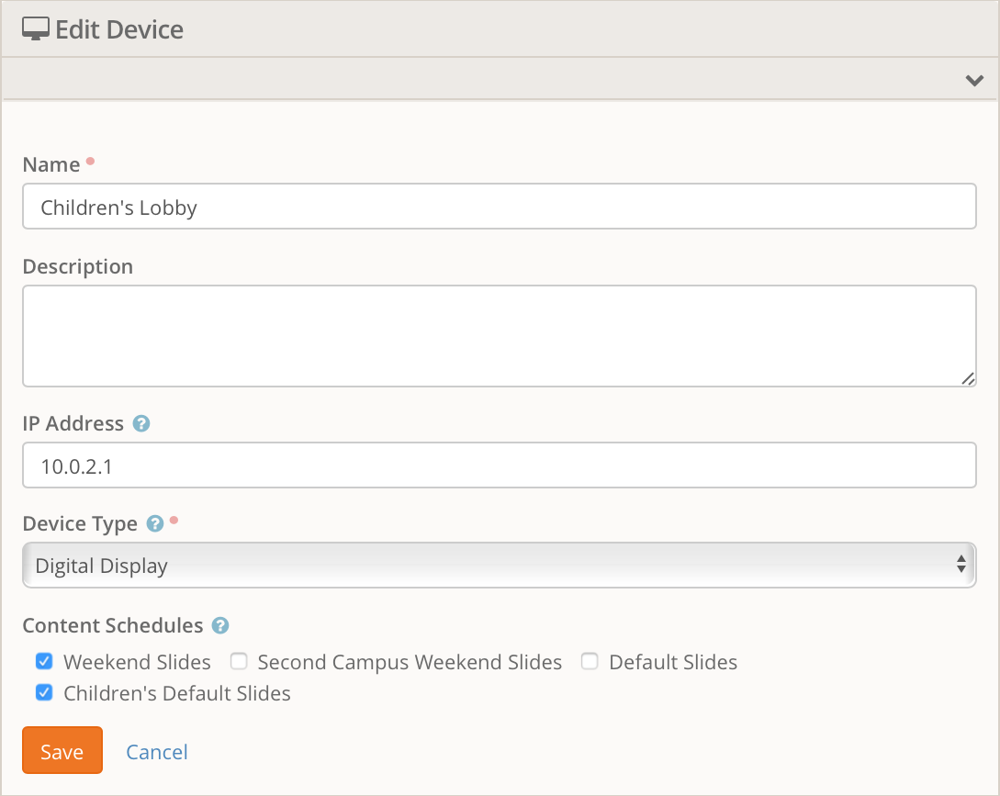
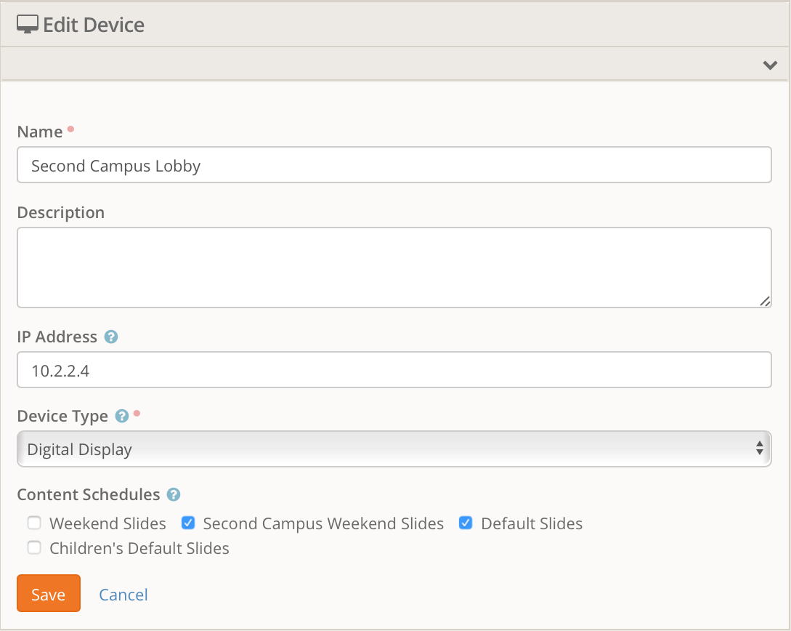

# Digital Signage for Rock RMS

This plug-in provides functionality to drive digital displays from Rock
Content Channels. Each content channel gets one or more schedules applied
to it via a Defined Value. A display device is registered in the system
and is configured for which of those Defined Values it will display for.

### Capabilities

A configured digital sign device simply displays an HTML page from Rock that
handles all the fancy magic. All done purely in HTML5, CSS and Javascript.
This means just about any modern web browser can be used as a display device.

> Note: I said "modern". This means the web browser in your smart TV or
> Kindle probably won't work correctly - if at all.

The content displayed in the slideshow can be a mixture of images and videos.
The images are uploaded directly into Rock while the videos are URL links to
the video.

Each configured slideshow can also have background audio that is composed of
MP3 files that have been uploaded into Rock.

There are a number of transitions between each slide that can be used and,
by default, all transitions are enabled and randomly picked during each
transition. These range from simple dissolves, slide effects all the way
to page flips.

### Configuration Overview

A plug-in that is simple to configure is an amazing plug-in. Sorry this
plug-in is only a really good plug-in. Though once you get the concepts down
you shouldn't have any trouble building up your perfect display system.

* All of the content (images, audio, video links) is stored in Content
Channels.
* All of your display devices (computers) are setup as Devices in the
Check-in Configuration section.
* Linking these two things together is a set of Defined
Values that you will configure. These Defined Values (of type `Digital Sign
Content Schedules`) let you configure schedules that are tied to the content
channels. These will often referred to as just `Content Schedules`.

### Devices

When you define a device in Rock you specify the IP address that it has.
The normal URL for a device to use is `/digitalsign`, such as
`http://rock.rocksolidchurchdemo.com/digitalsign`. This will look for a device
that matches the client's IP address.

There are times, however, when you might not be able to assign a static IP
address to a computer or you want multiple computers to share the same
configuration. A second way to access the URL is `/digitalsign/##` where the
`##` is the Rock Device Id number. Accessing this way will bypass the IP
lookup and simply dish out the content for the requested device.

### Block Settings

* `Slide Interval` - The number of seconds between slide transitions.
* `Update Interval` - How often, in seconds, will the block check for changes
to the content that should be displayed.
* `Transitions` - The transitions that will be used by this page. If you
want different devices to have different transitions you will need to
configure a second page with different block settings.
* `Content Channel Override` - This is mostly used for testing but you can
use it if you wish. Setting this overrides the content schedules completely
and simply serves up the selected content channel at all times.

### Configuration Example

So let's assume that we want to have a set of generic slides that play
during the week, and then another set that play during weekend services. We
will call these two content channels `Default Slides` and `Weekend Slides`
respectively.

When you create a content channel for use on a digital display it must
inherit from the content channel type `Digital Signage`. This provides the
needed attributes. So we have created our two content channels and populated
them with the content we want displayed.

Next we will create two entries in our `Digital Sign Schedules` defined type.
One will be called `Weekend Slides` and have the schedules selected for our
weekend services along with the `Weekend Slides` content channel. The second
will be called `Default Slides`, it will have no schedules selected and will
have the `Default Slides` selected as the content channel. These are our
`Content Schedules`.

> Note: When a `Content Schedule` has no schedules then it is assumed to
> always match. Since these `Content Schedules` are matched top to bottom
> then this allows you to put a "catch-all" content channel at the end of
> your list.

With the above note in consideration, make sure your `Default Slides` defined
value as at the bottom of the list.

You might be wondering why you can't just set the schedule on the content
channel. There are two reasons. First is we need the ability to set a priority
(order) for the content channels so that more specific schedules will be
matched before broader schedules. The second is that you might want to have
two screens showing the same content channel but at different schedules times.
That brings us to our final piece to configure. The `Digital Display` device.

So now we have our content channels setup and the schedules for when they
should be displayed. But we have not configured a kiosk device to display
anything yet.

When you create a new `Device` (configured under the
`Admin Tools > Check-in > Devices` page) and set it's type to `Digital Display`
then a new attribute will become available called `Content Schedules`. This
is a list checkboxes that each represent the `Digital Sign Schedules` that
you have defined. For the moment lets setup a single device and select both
`Content Schedules` that we created above. Our new kiosk device will now
display the `Weekend Slides` content channel during service times and display
the `Default Slides` content channel at any other time.

If we have a second kiosk display in a different building it can be configured
to display different (or the same) `Content Schedules`. For example, lets say
this second device is in the children's building while the first device was
in the main worship center lobby. During service we want them to display the
same `Weekend Slides` content channel. But during the week they have different
slideshows to run. You can create a third content channel and call it
`Children's Default Slides`, then create a new defined value of `Digital
Sign Schedules` type with no schedule and reference your new content channel.
(Remember to make sure this new one is also at the end of the list)

The first device we setup will not consider displaying these slides because
you have not turned on that checkbox in it's configuration. When you create
your new Device entry for the children's building you would select the
`Weekend Slides` content schedule and the `Children's Default Slides`.

A final example would be a second campus that has different service times.
We still want to show the same `Weekend Slides` but since they have
different service times the `Digital Sign Schedule` entry we created will
not work for them. All we need to do is create another scheduled entry with
the proper schedule selected and the kiosk at that location will reference
this new schedule and the `Default Slides`.

Below are some screenshots that show our final configuration.

 

### Supported Media Types

#### Images

Any image file will be automatically scaled to the resolution of the browser
window. Smaller images will be scaled up and larger images will be scaled
down. So you if you have displays running at different resolutions you can
upload images at the highest supported resolution and they will be scaled
properly.

You can also mix aspect ratios (some displays at 4:3 and some at 16:9). Any
image will be resized to fit the entire image on screen with black bars
added as needed.

Pretty much any image file type can be used. But you should limit yourself
to standard web formats such as PNG or JPG.

#### Video

If you want to throw in some videos for people to watch (audio is played too)
then put the link to the video in the `Video URL` attribute of the
content channel item. When setting up a video slide you should leave the
`Image` attribute blank.

Since we don't know the actual length of the video we are using the public
Javascript APIs from the respective video providers to receive events when
the video finishes playing. This can cause hangups if 1) something just goes
terribly wrong during playback and the video stops or 2) a network
interrupt causes the video to stutter enough that the browser gives up
trying to play it but doesn't trigger the "video ended" event.

##### Supported video providers

* Vimeo
* Youtube

#### Audio

You can add background audio to your slideshow. The only supported file type
is MP3. Upload your MP3 the same way you would for building an image slide
except instead of uploading a PNG to the `Slide` attribute upload your MP3
file instead. You obviously won't get a preview image but it will work.

When the slideshow starts any MP3 files will be compiled into a playlist and
played one after another and loop when the playlist ends. If there a video
slide comes up then the audio will fade out and then fade back in once the
video has finished.

### Supported Clients

This plug-in has been tested with the following browsers:

* Chrome 59.0.3071.115 for Windows
* Edge 40.15063.0.0
* Firefox 54.0.1 for Windows
* Firefox 49.0.2 for Mac
* Internet Explorer 11.483.15063.0 1
* [Porteus-Kiosk](http://porteus-kiosk.org/) 4.4.0 with Firefox

Other versions of browsers and clients will probably work too. These are
just the ones that we have explicitly tested.

And seriously. What is with these web browser version numbers. Could they
get any longer?

**Known Issues**

1 - Internet Explorer does not work handle the 3D transitions properly.

### Unsupported Clients

The following clients are known to not work.

* iOS (iPhone and iPad). Audio does not work, video does not auto-play,
transitions do not work.